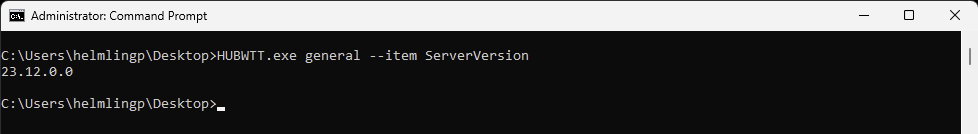

# Intelligent Hub for Windows Troubleshooting Tool (HUBWTT)

### Replace this with a video demo

HUBWTT.exe is a CLI app to display Workspace ONE Hub for Windows (HUBW) configuration settings as well as perform some functions to help with supporting HUBW:
 
- [Managed Applications Info](./docs/apps.md)
- [Baselines Info](./docs/baselines.md)
- [Export HUBW LiteDB](./docs/exporthub.md)
- [General (HUBW), Sample and Custom Lookup info](./docs/general.md)
- [LAPS Function](./docs/laps.md)
- [Profiles Info](./docs/profiles.md)
- [Scripts Info](./docs/scripts.md)
- [Sensors Info](./docs/sensors.md)
- [Test Network Function](./docs/testnet.md)
- [Workflows Info](./docs/workflows.md)

The tool was developed as a Proof of Concept for HUBCLI on Windows devices, an often requested function currently deployed with the macOS and Linux Intelligent HUB.

## Primary Use Cases

The tool is intended for desktop administrators to troubleshoot Windows devices managed by Workspace ONE UEM. The tool can display information about applications, profiles, sensors, scripts and workflows, as well as securely export a backup copy of HUBW to provide to Omnissa GCS and Engineering. 

Newer functionality including providing a LAPS 'like' functionality has recently been added, and leverages public / private key RSA compatible certificates to secure the storage and visibility of the generated password.

Using the --item option, the tool can display more detail about an individual item including the install command and detection criteria for an application deployed with SfD, or the actual script deployed with Workspace ONE Scripts as examples.

Additional functionality such as testing network connectivity from this device to required network endpoints as documented at [Workspace ONE UEM Ports](https://ports.esp.vmware.com/home/Workspace-ONE-UEM). Microsoft also requires numerous network endpoints whitelisted for functions such as WNS that are documented here [Manage Windows 11 Endpoints](https://learn.microsoft.com/en-us/windows/privacy/manage-windows-11-endpoints), and are included in the testing. This is useful for both enrolled and yet to be enrolled devices.

This functionality has been added to identify issues relating to network security that commonly prevent base product functionality such as enrolment, reducing customer and GCS troubleshooting time. In fact, all functionality is focused on this end goal.

## Requirements

- .NET 6.0 (requirement for HUBW already)
- Windows 10+
- Workspace ONE HUB for Windows 2109+ (requires LiteDB)
- Administrator: Command Prompt

## Note: The following limitations exist today:

- Workspace ONE Intelligent Hub for Windows 22.03 to 23.02. An update to support newer HUBW versions will be released soon.
- Windows 11 ARM64 not supported
- Many Profiles do not display

        Phil Helmling, helmlingp@vmware.com, @philhelmling

# Disclaimer

**THE SOFTWARE IS PROVIDED "AS IS", WITHOUT WARRANTY OF ANY KIND, EXPRESS OR
IMPLIED, INCLUDING BUT NOT LIMITED TO THE WARRANTIES OF MERCHANTABILITY,
FITNESS FOR A PARTICULAR PURPOSE AND NONINFRINGEMENT. IN NO EVENT SHALL
VMWARE,INC. BE LIABLE FOR ANY CLAIM, DAMAGES OR OTHER LIABILITY, WHETHER
IN AN ACTION OF CONTRACT, TORT OR OTHERWISE, ARISING FROM, OUT OF OR IN
CONNECTION WITH THE SOFTWARE OR THE USE OR OTHER DEALINGS IN THE SOFTWARE.**

## Usage

HUBWTT provides options to list information within relative groups:

HUBWTT also provides detailed information on individual items specified with the --item option. Use the **--item _NameOfAttribute_** to return only the value of that item. This is great for returning a value to a sensor. This option is available with many of the provided functions. For example:

`HUBWTT.exe g --item ServerVersion`

## Future Improvements

Future features include:
- Support ARM64 devices
- Capture logs into a ZIP
- Captured logs included with ExportHUBW function
- Improve exportHUBW to zip with password provided
- Redirect logs to central log server for analysis
- Display App deployment log details
- Display all profiles
- Sort Workflow steps
- Display Workflow steps json
- Initiate HUBW sync with strict thresholds
- Add Enrolment User SID Mismatch check
- Enrol device with pre-installed Workspace ONE Intelligent Hub (AirwatchAgent.msi) similar to command line enrolment. Good for imaging and VDI use cases.
- Unenrol device without uninstalling Workspace ONE Intelligent Hub (AirwatchAgent.msi). Good for VDI and troubleshooting.
- Add agent cleanup for unenrolled devices (great for testing)
