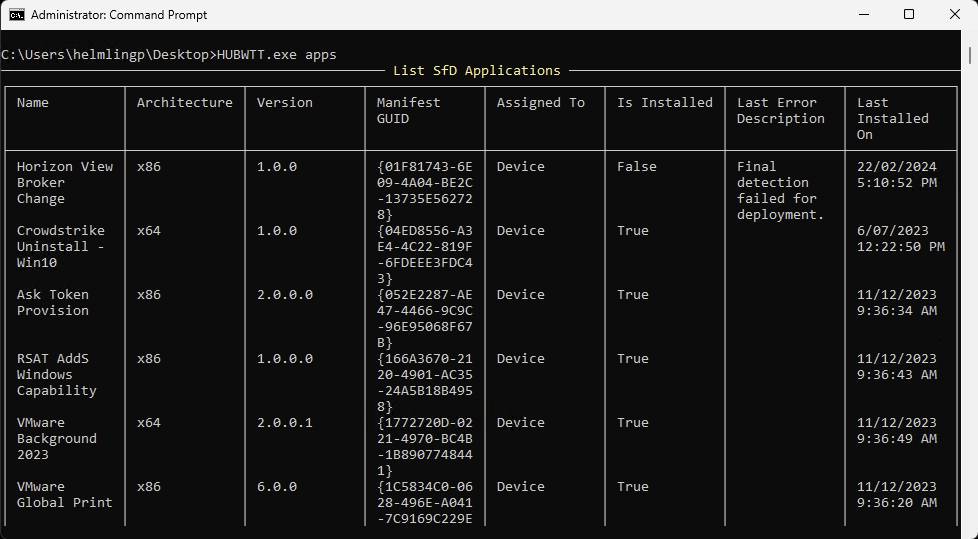
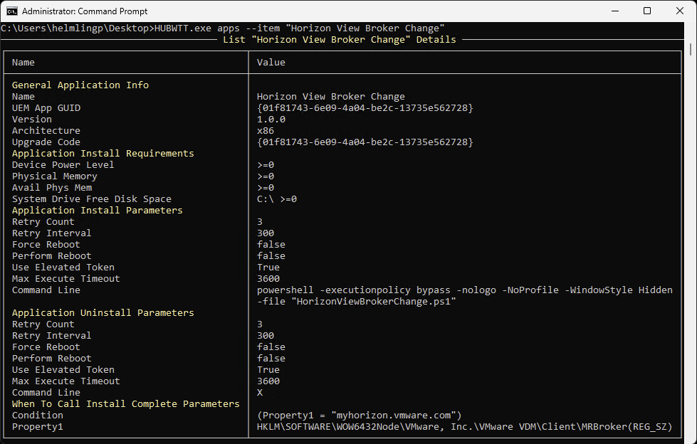

# Apps Information

`HUBWTT.exe apps` or `HUBWTT.exe a` or `HUBWTT.exe A`

List **managed** applications deployed to the device, including the name, architecture, assignment, install status, last error reported and last install date/time.

The name of the application can be provided to the **--item** option to return details about the specific application. This is useful for troubleshooting application deployments without having to view SfD logs stored in the registry in XML data format.

`HUBWTT.exe a --item "Horizon View Broker Change`

