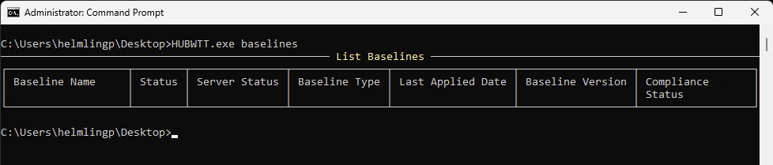

# Baselines Information

`HUBWTT.exe baselines` or `HUBWTT.exe b` or `HUBWTT.exe B`

List Baselines deployed to the device, including the status on the device, the status on the server, when the baseline was last applied to the device and the overall compliance status according to the baseline.

