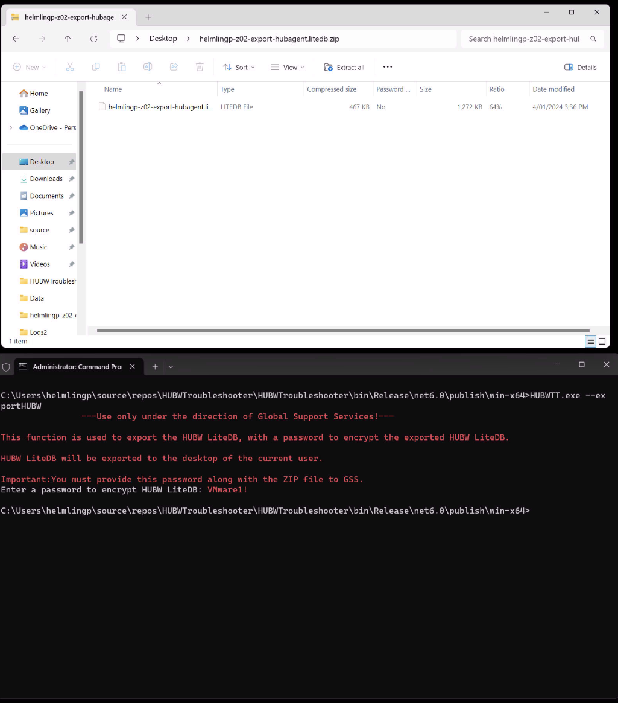

# Export HUBW LiteDB

This function backs up or exports the HUBW LiteDB to allow Engineering and Global Support Services to analyse a device for support purposes.

The function:

- requests a password from the user, which will be used to encrypt the LiteDB
- copies the current HUBW LiteDB file
- encrypts the backup copy with the password and a salt
- performs an integrity check of the backup copy and closes gracefully
- moves the backup copy to the desktop of the current user
- creates a ZIP file that includes the backup copy with the naming convention *devicename-export-hubagent.litedb*.

**Note: This function should only be used under the direction of GSS and Engineering.**

## Please provide the ZIP file AND password to GSS!

**Note:**

It is also important to note that in this version, the ZIP file itself is not password protected/encrypted. 

The ***devicename-export-hubagent.litedb*** file is encrypted and password protected and can only be opened by Global Support Services. 

`HUBWTT.exe exportHUBW`

## Future Improvements

- Captured logs included with ExportHUBW function
- Improve exportHUBW to zip with password provided
