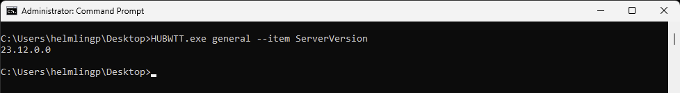

# General HUBW Information

`HUBWTT.exe general` or `HUBWTT.exe g` or `HUBWTT.exe G`

Lists Hub for Windows configuration settings, HUBW sample info such as when the sample was taken and sent, and other custom lookup info such as Custom Attributes, and enrolled user email address.

This command will output general HUB configuration settings, HUB Samples Last Sent Time followed by HUB Custom Lookup values into separate tables as displayed below:

This table is useful for determining when information is sent back to the platform.

This table is useful for determining other values.

The name of the attribute can be provided to the **--item** option to return details about a specific attribute.

This is useful for returning this value with a sensor, for example:

`HUBWTT.exe g --item ServerVersion`

