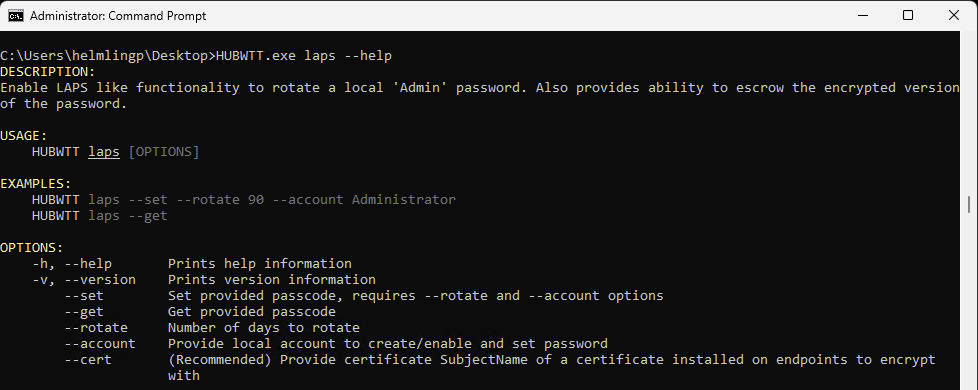
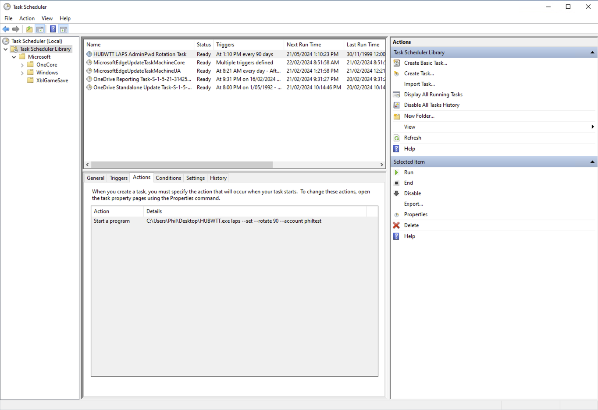
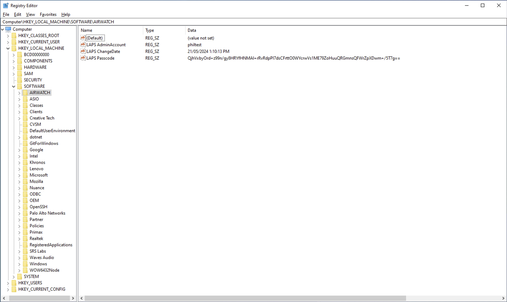
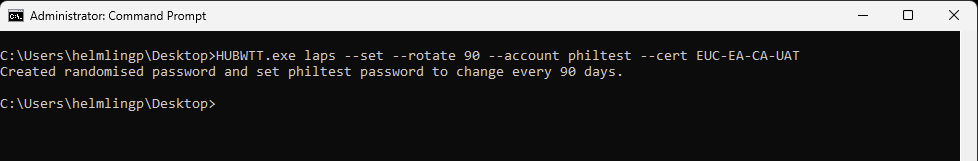
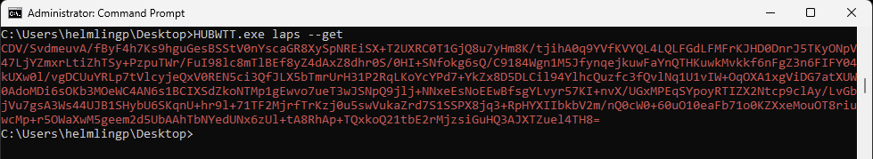
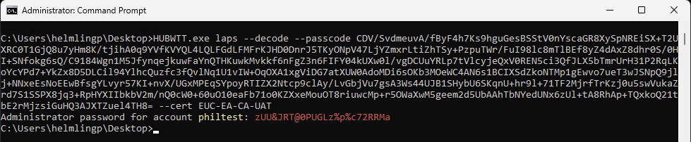
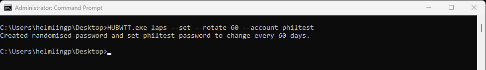
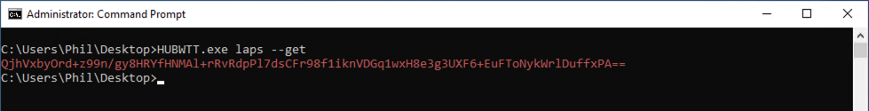
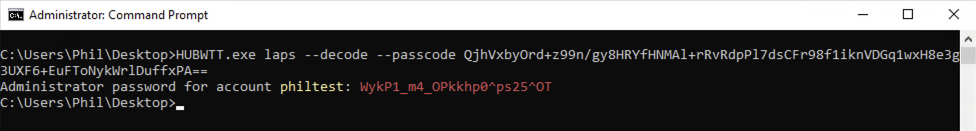

# LAPS

`HUBWTT.exe laps`

This function enables a LAPS 'like' functionality to create a randomly generated password, set it for a specified local account, encrypted with the provided certificate public key and hashed for storage in the registry and setup Schedule Task to re-run the same command at the specified interval (days). 

The function is designed for 3 phases of operation:

1. **Set** the account, rotation schedule, encryption and store the randomly generated password in the registry
2. **Get** the encrypted and Base64 encoded passcode from the registry
3. **Decode** the provided encrypted and Base64 encoded passcode using the same encryption certificate.

## --Set

### Specify a local Admin account

The 'Admin' account is specified with the `--account` option.

**Note:** If the 'Admin' account does not exist it will be created. If the 'Admin' account is disabled, it will be enabled.

### Specify the rotation schedule

The rotation schedule is specified with the `--rotate` option and is an integer. The schedule is implemented with a Scheduled Task that runs at the interval specified.

### Specify the certificate to use

The certificate used for encryption is specified with the `--cert` option. 

**Note:** Specifying an RSA certificate is the recommended approach. The cert with public key should be deployed to all Windows devices in the device Personal Store. This is the default location when deploying certs. The cert with the private key would be stored on the Windows device used for decrypting the passcode (the administrator's device).

When utilising a certificate with a public/private key, only an Administrator with the tool, the passcode and the certificate with private key can decode the passcode to get the password.

### Set the password

A 24 character, randomly generated string is created with a combination of the below `validChars`, then encrypted with the RSA public key (certificate), then Base64 encoded.

`validChars = "ABCDEFGHJKLMNOPQRSTUVWXYZabcdefghijklmnopqrstuvwxyz0123456789!@#$%^&*?_-"`

### Store the passcode

The encrypted and Base64 encoded passcode is stored in the `HKLM\SOFTWARE\AirWatchMDM` registry key, which is only accessible by users with local Administrator permissions. The passcode can then be retrieved by a sensor using the --get option.

### Set Usage

`HUBWTT.exe laps --set --rotate 90 --account AccountName --cert certificate_subjectName`

The passcode can also be encrypted with the **AwDeviceRoot** certificate deployed to an enrolled device. This certificate is specific to each Workspace ONE UEM tenant. See the [For Proof of Concept](#for-proof-of-concept-purposes) section below.

## --Get

The `--get` function provides the ability to escrow the encrypted and Base64 encoded passcode. 

The function simply reads the relevant registry key.

This function can be utilised with a sensor so an admin can see it in the console or Intelligence report and then decode the passcode with a hidden command in this same utility. 

It can also be used within a Workspace ONE Assist CLI unattended session in case a device is locked out.

### Get Usage

`HUBWTT.exe laps --get`

Run --get within a WS1 Sensor to escrow the encrypted version of the password.

## --Decode

From a device enrolled into the same WS1 tenant, and with a certificate holding the private key, decrypt the passcode back to the password.

The password can then be used to login to the device.

The corresponding username is also stored in the same protected registry location as the passcode. It is also returned to the CLI with the decoded passcode(password).

## --Decode Usage

`HUBWTT.exe laps --decode --passcode passcode_string --cert certificate_subjectName`

### For Proof of Concept purposes

The **AwDeviceRoot** certificate deployed to an enrolled device will be used to encrypt the password. Bear in mind that this capability is not as secure as using a public/private key pair to encrypt/decrypt the password.

