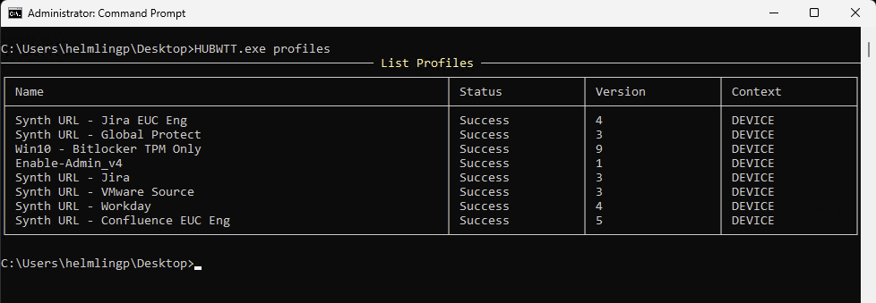
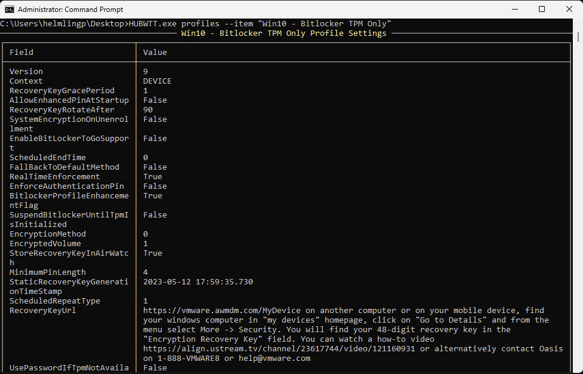

# Profiles Information

`HUBWTT.exe profiles` or `HUBWTT.exe p` or `HUBWTT.exe P`

List Profiles deployed to the device including the install status, version and context deployed to. 

**Note: Only some profiles are displayed at present. Future development on this to come!**

Use the **--item _NameOfProfile_** parameter to return detailed info on that profile. For example:

`HUBWTT.exe p --item "Win10 - BitLocker TPM Only Profile Settings"`

