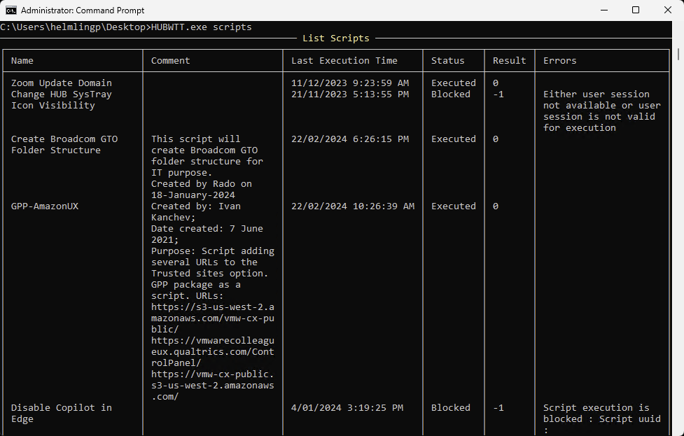

# Scripts Information

`HUBWTT.exe scripts` or `HUBWTT.exe s` or `HUBWTT.exe S`

This function lists any Workspace ONE Scripts deployed to the device, and includes the last execution date/time, the deployment status, result code and error.

_**Note:**_ _Scripts are also deployed with Workflows and are also listed here._

Use the **--item _NameOfScript_** to return detailed info on that script, including the actual script code, last sample send and last return value. This is very useful when troubleshooting deployments, script formatting issues and determining actual return values. For example:

`HUBWTT.exe s --item "GPP-AmazonUK"`

