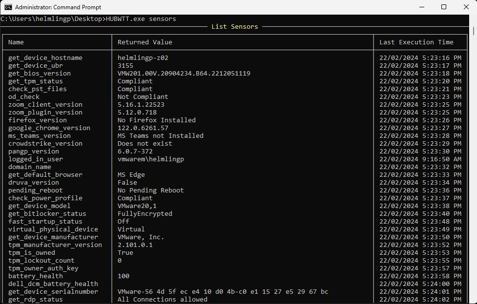
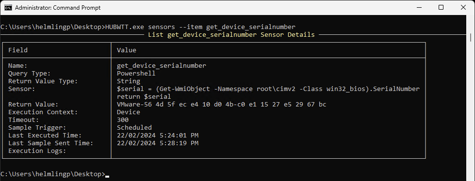

# Sensors Information

`HUBWTT.exe sensors` or `HUBWTT.exe e` or `HUBWTT.exe E`

List Sensors deployed to the device including the name of the sensor, the returned value and last execution date/time.

Use the **--item _NameOfSensor_** to return detailed info on that sensor, including the actual sensor code, last sample send and last return value. For example:

`HUBWTT.exe e --item get_device_serialnumber`

