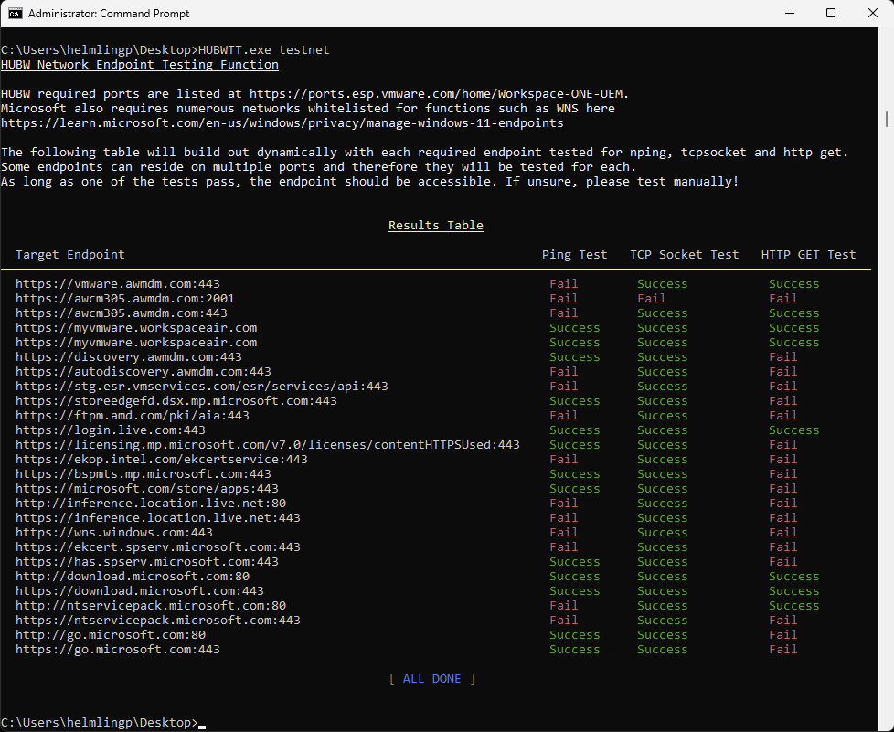

# Test Network

`HUBWTT.exe testnet`

This function tests documented HUBW network endpoints from the running device, to required network endpoints as documented at
[Workspace ONE UEM Ports](https://ports.esp.vmware.com/home/Workspace-ONE-UEM).

This is useful for both enrolled and yet to be enrolled devices.

Microsoft also requires numerous network endpoints whitelisted for functions such as WNS that are documented here [Manage Windows 11 Endpoints](https://learn.microsoft.com/en-us/windows/privacy/manage-windows-11-endpoints).

The function will run the following tests on each endpoint:
- ping
- tcpsocket
- httpget
                
Some endpoints can reside on multiple ports and therefore each port and protocol will be tested for each endpoint. An example is the Device Services Server (vmware.awmdm.com in the screenshot example below).

As long as one of the tests pass, the endpoint should be accessible. **If unsure, please test manually!**

