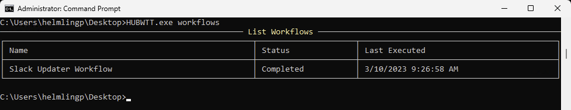
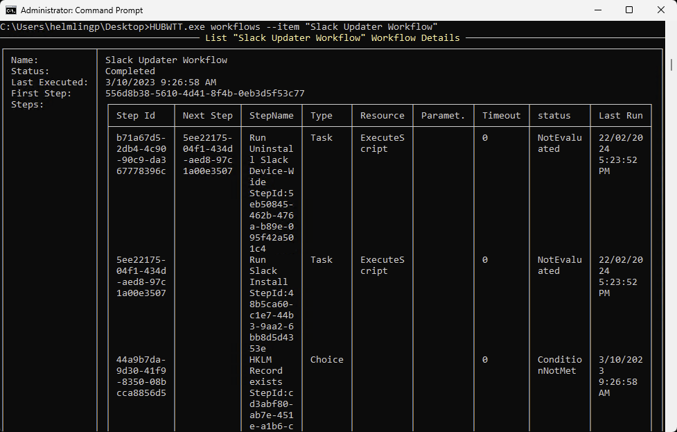

# Workflows Information

`HUBWTT.exe workflows` or `HUBWTT.exe w` or `HUBWTT.exe W`

List Workflows deployed to the device the name, status and last executed date/time.

Use the **--item _NameOfWorkflow_** to return detailed info on that workflow, including the status, workflow steps and details including last executed date/time of the individual step, next step, resource type, and status of each individual step. For example:

`HUBWTT.exe w --item "Slack Updater Workflow"`

